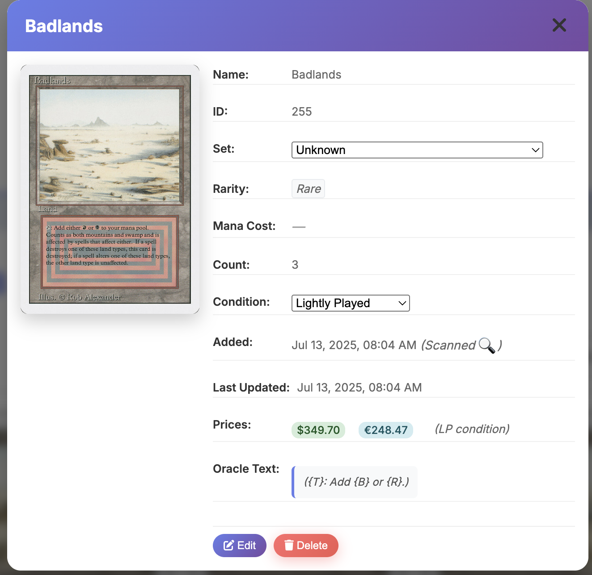

# Magic Card Scanner - Features Showcase

This visual guide showcases the key features and capabilities of the Magic Card Scanner application.

> **Note**: This document is designed to include screenshots and images. For the best experience, view this in a markdown viewer that supports images.

## 🏠 Main Interface

### Dashboard Overview
The main dashboard provides a clean, intuitive interface for managing your Magic card collection.

**Key Elements:**
- **Header**: Application title and navigation
- **Statistics Panel**: Real-time collection stats
- **Upload Area**: Drag-and-drop card scanning
- **Card Gallery**: Visual collection display
- **Tools Menu**: Export and utility functions

*The main dashboard showing the Magic Card Scanner interface with statistics panel and card collection*

### Statistics Dashboard
Real-time collection statistics update automatically as you add and manage cards.

**Displayed Information:**
- **Total Cards**: Number of unique cards (e.g., "79 cards")
- **Total Count**: Including duplicates (e.g., "79 total")
- **Total Value**: Collection worth (e.g., "$9,990.68")

*Collection overview showing comprehensive statistics and card organization*

---

## 📷 Card Scanning & AI Recognition

### Upload Interface
The drag-and-drop upload area makes scanning cards effortless.

**Features:**
- **Drag & Drop**: Simply drag images onto the upload zone
- **Click to Browse**: Traditional file selection
- **Progress Tracking**: Visual upload progress
- **Multiple Formats**: JPG, PNG, and more

*Drag-and-drop upload area for easy card scanning*

### AI Processing
Advanced AI recognition powered by OpenAI Vision API.

**Capabilities:**
- **Multi-card Detection**: Identifies multiple cards in one image
- **Automatic Recognition**: Card names, sets, and rarities
- **Price Lookup**: Real-time market values
- **Condition Assessment**: Intelligent condition detection

*[Screenshot placeholder: AI processing results showing identified cards]*

---

## 🎴 Card Display & Views

### Individual View Mode
See every card in your collection displayed separately.

**Features:**
- **Authentic Proportions**: Proper 2.5:3.5 Magic card ratio
- **Color Borders**: 6px borders matching card color identity
- **Card Information**: Name, set, and price below each card
- **Count Display**: Shows individual card counts

*Individual card view showing the collection in a responsive grid layout*

### Stacked View Mode
Duplicate cards are intelligently grouped with visual stack effects.

**Features:**
- **Stack Visualization**: Mini-fanned appearance for duplicates
- **Count Badges**: "×2", "×3", etc. overlays
- **Combined Values**: Total value of all copies
- **Expandable Stacks**: Click to see individual cards

*Full collection view demonstrating the comprehensive card management interface*

### Color Identity Borders
Cards display with authentic Magic color identity borders.

**Color System:**
- **White**: Light gray border
- **Blue**: Blue border  
- **Black**: Dark gray border
- **Red**: Red border
- **Green**: Green border
- **Multicolor**: Gold border
- **Colorless**: Gray border

*Cards displaying authentic Magic color identity borders*

---

## 🔍 Card Details & Management

### Card Detail Modal
Comprehensive card information in an elegant modal interface.

**Information Displayed:**
- **High-resolution card image**
- **Complete card details** (name, set, rarity, price)
- **Oracle text** (card abilities and flavor text)
- **Personal notes** (your custom annotations)
- **Condition tracking** (Near Mint, Lightly Played, etc.)

*Card detail modal showing comprehensive card information with editing capabilities*

### Editable Fields
Easily modify card information directly in the detail view.

**Editable Properties:**
- **Condition**: Dropdown with standard conditions
- **Set**: Comprehensive set selection
- **Rarity**: Common, Uncommon, Rare, Mythic
- **Notes**: Personal tracking notes
- **Count**: Number of copies owned

*[Screenshot placeholder: Edit mode showing dropdown menus]*

### Navigation
Seamless navigation between cards without leaving the detail view.

**Navigation Options:**
- **Previous/Next arrows**: Browse through collection
- **Keyboard shortcuts**: Arrow keys for navigation
- **Direct access**: Click cards from gallery
- **Modal controls**: Easy close and navigation

*[Screenshot placeholder: Navigation arrows and controls]*

---

## 🔍 Search & Filtering

### Real-time Search
Instant search results as you type, with comprehensive coverage.

**Search Capabilities:**
- **Card Names**: Primary search target
- **Set Names**: Find cards by set
- **Personal Notes**: Search your annotations
- **Partial Matching**: Find cards with incomplete names

*[Screenshot placeholder: Search bar with results updating in real-time]*

### View Filters
Toggle between different view modes and filter options.

**Filter Options:**
- **Individual/Stacked**: Switch view modes
- **Show Examples**: Include/exclude example cards
- **Condition Filter**: Filter by card condition
- **Set Filter**: Show only specific sets

*[Screenshot placeholder: Filter controls and options]*

---

## 💾 Export & Backup System

### Export Modal
Comprehensive export options with user-friendly interface.

**Export Features:**
- **Format Selection**: CSV (default) or Excel
- **File Path Selection**: Browse to choose save location
- **Custom Filename**: Choose your own filename
- **Overwrite Protection**: Confirmation before overwriting

*Export modal showing CSV/Excel format selection and file location options*

### Export Progress
Visual progress tracking during export operations.

**Progress Features:**
- **Progress Bar**: Visual completion indicator
- **Status Messages**: "Preparing export...", "Exporting data..."
- **Completion Notification**: Success message with file location
- **Error Handling**: Clear error messages if issues occur

*[Screenshot placeholder: Export progress bar and status messages]*

### Backup Management
Automatic and manual backup capabilities.

**Backup Features:**
- **Automatic Backups**: Every 6 hours by default
- **Manual Backups**: On-demand backup creation
- **Timestamped Files**: Each backup clearly dated
- **Backup History**: View all previous backups

*[Screenshot placeholder: Backup management interface]*

---

## 📊 Statistics & Analytics

### Collection Analytics
Detailed insights into your collection composition and value.

**Analytics Features:**
- **Set Distribution**: Cards by set with percentages
- **Rarity Breakdown**: Distribution of rarities
- **Color Analysis**: Cards by color identity
- **Value Tracking**: Current market values

*[Screenshot placeholder: Statistics dashboard with charts and graphs]*

### Value Tracking
Monitor your collection's worth over time.

**Value Features:**
- **Current Prices**: Real-time market values
- **Total Collection Value**: Combined worth
- **Individual Card Values**: Per-card pricing
- **Condition Impact**: How condition affects value

*[Screenshot placeholder: Value tracking interface]*

---

## 🔧 Advanced Features

### Example Card System
Distinguish between owned cards and reference examples.

**Example Features:**
- **Example Badges**: Clear visual indicators
- **Separate Counting**: Examples don't count toward stats
- **Reference Library**: Keep examples for reference
- **Toggle Visibility**: Show/hide examples

*[Screenshot placeholder: Cards with example badges]*

### Duplicate Management
Intelligent handling of duplicate cards in your collection.

**Duplicate Features:**
- **Smart Grouping**: Automatic duplicate detection
- **Stack Visualization**: Visual representation of multiples
- **Individual Access**: View each copy in a stack
- **Count Tracking**: Accurate counting of duplicates

*[Screenshot placeholder: Duplicate cards in stacked view]*

### Data Safety
Comprehensive data protection and recovery options.

**Safety Features:**
- **Soft Deletion**: Deleted cards marked, not removed
- **UUID Tracking**: Unique identifiers for all cards
- **Audit Trail**: Track all changes and operations
- **Recovery Options**: Restore accidentally deleted cards

*[Screenshot placeholder: Data safety features and recovery options]*

---

## 🎨 User Interface Design

### Responsive Design
The interface adapts beautifully to different screen sizes.

**Design Features:**
- **Mobile Friendly**: Works on phones and tablets
- **Desktop Optimized**: Full-featured desktop experience
- **Flexible Grid**: Cards arrange based on screen size
- **Touch Support**: Touch-friendly on mobile devices

*[Screenshot placeholder: Interface on different screen sizes]*

### Visual Polish
Attention to detail in every aspect of the interface.

**Polish Features:**
- **Smooth Animations**: Elegant transitions and effects
- **Consistent Styling**: Unified design language
- **Accessibility**: High contrast and readable fonts
- **Professional Look**: Clean, modern aesthetic

*[Screenshot placeholder: Interface showing visual polish and animations]*

---

## 🚀 Performance Features

### Optimized Loading
Fast, efficient performance even with large collections.

**Performance Features:**
- **Lazy Loading**: Cards load as needed
- **Efficient Caching**: Reduced API calls
- **Optimized Queries**: Fast database operations
- **Progressive Enhancement**: Core features load first

*[Screenshot placeholder: Performance metrics or loading indicators]*

### Server Management
Robust server management with monitoring capabilities.

**Management Features:**
- **Process Monitoring**: Server status tracking
- **Log Management**: Comprehensive logging
- **Error Handling**: Graceful error recovery
- **Resource Optimization**: Efficient resource usage

*[Screenshot placeholder: Server management interface or logs]*

---

## 📱 Cross-Platform Compatibility

### Browser Support
Works seamlessly across all modern browsers.

**Supported Browsers:**
- **Chrome**: Full feature support
- **Firefox**: Complete compatibility
- **Safari**: Optimized for macOS
- **Edge**: Windows integration

*[Screenshot placeholder: Interface in different browsers]*

### Operating System Support
Compatible with all major operating systems.

**Supported Systems:**
- **macOS**: Native-feeling integration
- **Windows**: Full Windows compatibility
- **Linux**: Complete Linux support
- **Mobile**: Responsive mobile experience

*[Screenshot placeholder: Application on different operating systems]*

---

## 🔮 Future Enhancements

### Planned Features
Exciting developments coming to the Magic Card Scanner.

**Upcoming Features:**
- **Mana Symbol Display**: Visual mana costs
- **Deck Building**: Create and manage decks
- **Trading Tools**: Track trades and want lists
- **Mobile App**: Native mobile application
- **Cloud Sync**: Sync across devices

*[Mockup placeholder: Future feature concepts]*

### Community Features
Building a community around Magic card collection.

**Community Plans:**
- **Collection Sharing**: Share collection highlights
- **Trade Matching**: Find trading partners
- **Price Alerts**: Notifications for price changes
- **Set Completion**: Track completion progress

*[Mockup placeholder: Community features concept]*

---

## 🎯 Use Cases

### Personal Collection Management
Perfect for managing your personal Magic card collection.

**Use Case Examples:**
- **Inventory Tracking**: Know exactly what you own
- **Value Monitoring**: Track collection worth
- **Condition Management**: Monitor card conditions
- **Organization**: Keep everything organized

*[Screenshot placeholder: Personal collection management workflow]*

### Trading and Selling
Excellent tool for traders and sellers.

**Trading Features:**
- **Quick Lookups**: Fast card identification
- **Value Assessment**: Current market prices
- **Condition Tracking**: Accurate condition records
- **Export Lists**: Share collection data

*[Screenshot placeholder: Trading workflow and features]*

### Collection Analysis
Deep insights into your collection composition.

**Analysis Features:**
- **Set Completion**: Track what you need
- **Value Distribution**: See where your money is
- **Rarity Analysis**: Understand your collection
- **Growth Tracking**: Monitor collection growth

*[Screenshot placeholder: Collection analysis dashboard]*

---

## 📞 Getting Started

### Quick Start Guide
Get up and running in minutes.

**Steps:**
1. **Download and Install**: Follow installation guide
2. **Configure API**: Add your OpenAI API key
3. **Start Scanning**: Upload your first card
4. **Explore Features**: Try different views and options

*[Screenshot placeholder: Quick start workflow]*

### Best Practices
Tips for getting the most out of the Magic Card Scanner.

**Recommendations:**
- **Good Lighting**: Ensure clear card images
- **Regular Backups**: Protect your data
- **Organize Notes**: Use consistent notation
- **Monitor Prices**: Track value changes

*[Screenshot placeholder: Best practices examples]*

---

## 🎉 Conclusion

The Magic Card Scanner represents a comprehensive solution for modern Magic: The Gathering collection management. With its combination of AI-powered recognition, intuitive interface, and powerful features, it transforms how you interact with your card collection.

**Key Benefits:**
- **Time Saving**: Automated card recognition
- **Comprehensive**: All features in one place
- **Reliable**: Robust data protection
- **User-Friendly**: Intuitive interface design
- **Powerful**: Advanced analytics and export

Whether you're a casual collector or serious trader, the Magic Card Scanner provides the tools you need to manage your collection effectively.

---

**Ready to get started?** Check out the [Installation Guide](INSTALLATION.md) and [User Guide](USER_GUIDE.md) to begin your digital collection journey!

*This showcase document is designed to be enhanced with actual screenshots and images of the application in use. Consider adding real screenshots to make this document even more compelling for users.* 