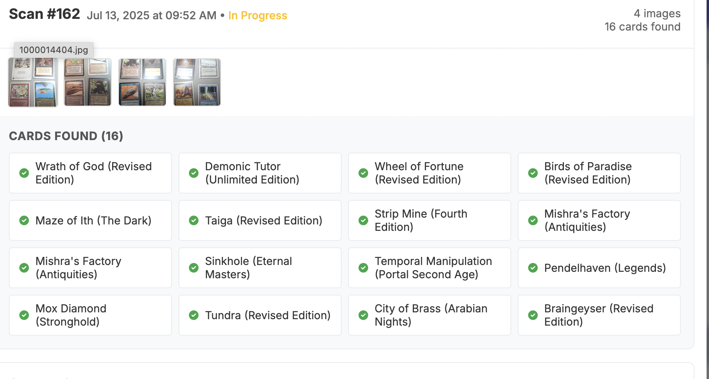

# Magic Card Scanner - User Guide

Welcome to the Magic Card Scanner! This comprehensive guide will walk you through all the features and capabilities of your personal Magic: The Gathering collection management system.

## 📋 Table of Contents

1. [Getting Started](#getting-started)
2. [Main Interface Overview](#main-interface-overview)
3. [Scanning Cards](#scanning-cards)
4. [Managing Your Collection](#managing-your-collection)
5. [Card Views & Navigation](#card-views--navigation)
6. [Card Details & Editing](#card-details--editing)
7. [Export & Backup](#export--backup)
8. [Search & Filtering](#search--filtering)
9. [Statistics & Analytics](#statistics--analytics)
10. [Advanced Features](#advanced-features)
11. [Troubleshooting](#troubleshooting)

---

## 🚀 Getting Started

### First Launch

When you first open the Magic Card Scanner at `http://localhost:8000`, you'll see the main interface with:

- **Header**: Application title and navigation
- **Stats Panel**: Collection statistics (initially showing 0 cards)
- **Upload Area**: Drag-and-drop zone for card images
- **Card Gallery**: Where your scanned cards will appear
- **Tools Menu**: Access to export and other utilities

*The main Magic Card Scanner interface showing all key components*

### Initial Setup

1. **Upload Your First Card**: Drag an image file or click to browse
2. **Wait for Processing**: The AI will analyze and identify the card
3. **Review Results**: Check the identified card details
4. **Start Building**: Continue scanning to build your collection

---

## 🖥️ Main Interface Overview

### Header Section
- **Title**: "Magic Card Scanner" with version info
- **Navigation**: Quick access to main features
- **Status Indicators**: Server connection and processing status

### Statistics Dashboard
Located at the top of the interface, showing:
- **Total Cards**: Number of unique cards in your collection
- **Total Count**: Total number of individual cards (including duplicates)
- **Total Value**: Estimated collection value in USD
- **Real-time Updates**: Statistics update automatically as you add/remove cards

### Upload Area
- **Drag & Drop**: Simply drag image files onto the upload zone
- **Click to Browse**: Traditional file browser option
- **Progress Tracking**: Visual progress bar during upload
- **Format Support**: Supports JPG, PNG, and other common image formats

### Card Gallery
- **Responsive Grid**: Cards automatically arrange based on screen size
- **View Toggle**: Switch between Individual and Stacked views
- **Search Bar**: Real-time search functionality
- **Sort Options**: Various sorting methods available

---

## 📷 Scanning Cards

### Supported Image Types
- **Individual Cards**: Single card photos
- **Multiple Cards**: Photos with multiple cards (AI identifies each)
- **Card Spreads**: Fanned out cards
- **Stack Photos**: Cards in piles

### Best Practices for Scanning
1. **Good Lighting**: Ensure cards are well-lit and clearly visible
2. **Flat Surface**: Place cards on a flat, contrasting background
3. **Full Card Visible**: Make sure the entire card is in frame
4. **Avoid Glare**: Minimize reflections on card surfaces
5. **High Resolution**: Use the highest quality setting on your camera

### AI Processing
The system uses OpenAI's Vision API to:
- **Identify Cards**: Recognize card names, sets, and rarities
- **Extract Details**: Pull mana cost, type, and other attributes
- **Price Lookup**: Fetch current market prices from Scryfall
- **Auto-Classification**: Determine card conditions and colors

### Processing Results
After scanning, you'll see:
- **Card Preview**: Thumbnail of the identified card
- **Card Details**: Name, set, rarity, and price information
- **Confidence Indicators**: Visual cues about recognition accuracy
- **Edit Options**: Ability to correct any misidentified information

---

## 🗂️ Managing Your Collection

### View Modes

#### Individual View
- **All Cards Shown**: Every card appears separately
- **Count Display**: Shows "Count: 1" for single cards
- **Price Display**: Individual card values
- **Full Details**: Complete information for each card

*Individual view showing cards in a responsive grid layout*

#### Stacked View
- **Grouped Duplicates**: Identical cards grouped together
- **Visual Stack Effect**: Mini-fanned appearance for stacks
- **Count Badges**: "×2", "×3", etc. for multiple copies
- **Total Value**: Combined value of all copies

### Card Organization
- **Automatic Sorting**: Cards sorted by newest first by default
- **Manual Reordering**: Drag and drop to reorder (future feature)
- **Grouping Options**: Group by set, color, or type
- **Filter Persistence**: Your view preferences are remembered

### Collection Statistics
Track your collection with comprehensive stats:
- **Card Count**: Total unique cards
- **Copy Count**: Total individual cards including duplicates
- **Estimated Value**: Current market value in USD
- **Set Distribution**: Cards by set and rarity
- **Color Distribution**: Cards by color identity

---

## 🎯 Card Views & Navigation

### Card Display Features

#### Visual Elements
- **Authentic Proportions**: Cards displayed in proper 2.5:3.5 ratio
- **Color Borders**: 6px borders matching Magic color identity:
  - White: Light gray border
  - Blue: Blue border
  - Black: Dark gray border
  - Red: Red border
  - Green: Green border
  - Multicolor: Gold border
  - Colorless: Gray border

#### Information Display
- **Card Name**: Prominently displayed below image
- **Set Information**: Set name and symbol
- **Price**: Current market value
- **Condition**: Card condition (Near Mint, etc.)
- **Count**: Number of copies owned

### Navigation Options

#### Gallery Navigation
- **Click Cards**: Click any card to view details
- **Arrow Keys**: Use left/right arrows to browse
- **Modal Navigation**: Navigate between cards within detail view
- **Stack Expansion**: Click stacked cards to see all copies

#### Detail Modal Navigation
- **Previous/Next**: Arrow buttons to browse collection
- **Close Options**: Click outside modal or use close button
- **Keyboard Shortcuts**: ESC to close, arrows to navigate
- **Direct Access**: Click specific cards from gallery

---

## ✏️ Card Details & Editing

### Card Detail Modal

When you click a card, a detailed modal opens showing:

*Card detail modal showing comprehensive information and editing options*

#### Card Information
- **High-Quality Image**: Full-size card image
- **Complete Details**: All card attributes
- **Market Price**: Current USD value
- **Set Information**: Set name, symbol, and rarity
- **Oracle Text**: Complete card text
- **Personal Notes**: Your custom notes

#### Editable Fields
- **Condition**: Dropdown with standard conditions
- **Set**: Comprehensive set selection
- **Rarity**: Common, Uncommon, Rare, Mythic
- **Notes**: Personal tracking notes
- **Count**: Number of copies owned

### Editing Process
1. **Open Card**: Click any card in the gallery
2. **Edit Mode**: Click the edit button or field
3. **Make Changes**: Update information as needed
4. **Save**: Changes auto-save or click save button
5. **Confirmation**: Visual feedback confirms changes

### Condition Tracking
Standard Magic card conditions:
- **Near Mint (NM)**: Perfect or nearly perfect condition
- **Lightly Played (LP)**: Minor wear, tournament legal
- **Moderately Played (MP)**: Noticeable wear, still playable
- **Heavily Played (HP)**: Significant wear
- **Damaged (DMG)**: Major damage, sleeve playable only

### Notes System
- **Personal Tracking**: Add custom notes to any card
- **Searchable**: Notes are included in search results
- **Flexible Format**: Support for any text format
- **Persistent**: Notes saved with card data

---

## 💾 Export & Backup

### Export Functionality

#### Export Options
- **CSV Format**: Spreadsheet-compatible comma-separated values
- **Excel Format**: Full-featured Excel workbook with formatting
- **Custom Filename**: Choose your own filename
- **Location Selection**: Browse to select export location
- **Overwrite Protection**: Confirmation before overwriting existing files

#### Export Process
1. **Open Tools Menu**: Click the tools dropdown
2. **Select Export**: Choose "Export Collection"
3. **Choose Format**: CSV (default) or Excel
4. **Select Location**: Browse to choose save location
5. **Confirm Export**: Review settings and export

*Export modal with format selection and file location options*

#### Exported Data
Your export includes:
- **Card Names**: Full card names
- **Set Information**: Set codes and names
- **Rarity**: Card rarities
- **Conditions**: Card conditions
- **Prices**: Current market values
- **Counts**: Number of copies
- **Notes**: Personal notes
- **Timestamps**: When cards were added

### Backup System

#### Automatic Backups
- **Scheduled Backups**: Every 6 hours by default
- **Smart Timing**: Only backs up when changes detected
- **Timestamped Files**: Each backup clearly dated
- **Local Storage**: All backups stored locally

#### Manual Backups
- **On-Demand**: Create backups anytime
- **Pre-Operation**: Automatic backups before major changes
- **Export as Backup**: Use export feature for external backups
- **Database Copies**: Direct database file backups

#### Backup Management
- **Backup History**: View all previous backups
- **Restore Options**: Restore from any backup point
- **Cleanup Tools**: Remove old backups to save space
- **Backup Verification**: Verify backup integrity

---

## 🔍 Search & Filtering

### Search Functionality

#### Real-Time Search
- **Instant Results**: Search results appear as you type
- **Comprehensive Search**: Searches names, sets, and notes
- **Partial Matching**: Find cards with partial name matches
- **Case Insensitive**: Search regardless of capitalization

#### Search Scope
- **Card Names**: Primary search target
- **Set Names**: Find cards by set
- **Notes**: Search personal notes
- **Oracle Text**: Search card text (future feature)

### Filtering Options

#### View Filters
- **Individual/Stacked**: Toggle between view modes
- **Show Examples**: Include/exclude example cards
- **Condition Filter**: Filter by card condition
- **Set Filter**: Show only specific sets

#### Advanced Filtering
- **Price Range**: Filter by card value
- **Date Range**: Filter by date added
- **Color Identity**: Filter by Magic colors
- **Rarity**: Filter by card rarity

### Search Tips
- **Use Quotes**: "Exact phrase" for exact matches
- **Wildcards**: Use * for partial matches (future feature)
- **Combine Terms**: Multiple words search all terms
- **Clear Search**: Empty search box to see all cards

---

## 📊 Statistics & Analytics

### Collection Overview

#### Basic Statistics
- **Total Cards**: Number of unique cards
- **Total Count**: All cards including duplicates
- **Total Value**: Estimated collection worth
- **Average Value**: Average card value

#### Detailed Analytics
- **Set Distribution**: Cards by set with percentages
- **Rarity Breakdown**: Distribution of rarities
- **Color Analysis**: Cards by color identity
- **Condition Summary**: Condition distribution

### Value Tracking
- **Current Prices**: Real-time market values
- **Price History**: Track value changes over time
- **Set Values**: Value by set and rarity
- **Condition Impact**: How condition affects value

### Collection Insights
- **Most Valuable**: Highest value cards
- **Largest Sets**: Sets with most cards
- **Recent Additions**: Newest cards added
- **Completion Status**: Set completion percentages

---

## 🔧 Advanced Features

### Example Card System
- **Mark Examples**: Designate cards as examples vs. owned
- **Visual Indicators**: Clear badges for example cards
- **Separate Counting**: Examples don't count toward collection stats
- **Reference Library**: Keep examples for reference

### Duplicate Management
- **Smart Grouping**: Automatically group identical cards
- **Stack Visualization**: Visual representation of duplicates
- **Count Tracking**: Accurate count of each card
- **Individual Access**: Access each copy in a stack

### Data Integrity
- **Soft Deletion**: Deleted cards marked, not removed
- **UUID Tracking**: Unique identifiers for all cards
- **Audit Trail**: Track all changes and operations
- **Recovery Options**: Restore accidentally deleted cards

### Performance Features
- **Lazy Loading**: Cards load as needed for speed
- **Efficient Caching**: Reduce API calls and improve speed
- **Optimized Queries**: Fast database operations
- **Responsive Design**: Works on all device sizes

---

## 🛠️ Troubleshooting

### Common Issues

#### Upload Problems
- **File Format**: Ensure images are in supported formats (JPG, PNG)
- **File Size**: Very large files may timeout
- **Network Issues**: Check internet connection for AI processing
- **API Limits**: OpenAI API may have rate limits

#### Recognition Issues
- **Poor Image Quality**: Ensure good lighting and focus
- **Partial Cards**: Make sure entire card is visible
- **Damaged Cards**: Heavily damaged cards may not recognize
- **Foreign Cards**: Non-English cards may have limited support

#### Performance Issues
- **Slow Loading**: Large collections may take time to load
- **Memory Usage**: Browser may slow with many cards
- **Database Size**: Very large databases may need optimization
- **API Delays**: Price lookups may be slow during peak times

### Solutions

#### Image Quality Tips
1. **Use Good Lighting**: Natural light or bright LED
2. **Stable Camera**: Avoid blurry photos
3. **Contrasting Background**: Dark cards on light background
4. **Clean Cards**: Remove dust and fingerprints
5. **Flat Position**: Avoid curved or bent cards

#### Performance Optimization
1. **Regular Backups**: Keep database size manageable
2. **Clear Cache**: Refresh browser if slow
3. **Close Other Tabs**: Free up browser memory
4. **Restart Server**: Restart if performance degrades
5. **Check Logs**: Review server logs for issues

### Getting Help

#### Log Files
- **Server Logs**: Check `logs/server.log` for errors
- **Browser Console**: Check for JavaScript errors
- **Network Tab**: Monitor API calls and responses
- **Database Queries**: Review database operations

#### Support Resources
- **Documentation**: This user guide and README
- **Issue Tracker**: Report bugs on GitHub
- **Community**: Connect with other users
- **Updates**: Check for new versions regularly

---

## 🎉 Tips & Best Practices

### Collection Management
1. **Regular Backups**: Export your collection regularly
2. **Consistent Conditions**: Use standard condition grades
3. **Detailed Notes**: Add notes for special cards
4. **Organize Regularly**: Keep your collection tidy
5. **Price Monitoring**: Check values periodically

### Scanning Efficiency
1. **Batch Processing**: Scan multiple cards at once
2. **Good Setup**: Create a dedicated scanning area
3. **Consistent Lighting**: Use the same lighting setup
4. **Quality Control**: Review AI results before saving
5. **Backup Before Bulk**: Backup before large additions

### Data Safety
1. **Multiple Backups**: Keep backups in different locations
2. **Regular Exports**: Export data for external backup
3. **Test Restores**: Verify backup integrity
4. **Version Control**: Keep multiple backup versions
5. **Secure Storage**: Protect your backup files

---

## 📈 Future Enhancements

### Planned Features
- **Mana Symbol Display**: Visual mana costs
- **Deck Building**: Create and manage decks
- **Trading Tools**: Track trades and want lists
- **Mobile App**: Native mobile application
- **Cloud Sync**: Sync across devices
- **Advanced Analytics**: Deeper collection insights

### Community Features
- **Collection Sharing**: Share collection highlights
- **Trade Matching**: Find trading partners
- **Price Alerts**: Notifications for price changes
- **Set Completion**: Track set completion progress
- **Wishlist**: Track cards you want to acquire

---

## 📞 Support & Contact

### Getting Help
- **Documentation**: Start with this guide and README
- **GitHub Issues**: Report bugs and request features
- **Community Forums**: Connect with other users
- **Email Support**: Contact for urgent issues

### Contributing
- **Bug Reports**: Help improve the application
- **Feature Requests**: Suggest new functionality
- **Code Contributions**: Submit pull requests
- **Documentation**: Help improve guides
- **Testing**: Test new features and updates

---

**Thank you for using Magic Card Scanner!** We hope this guide helps you make the most of your digital collection management experience. Happy collecting! 🎴✨ 